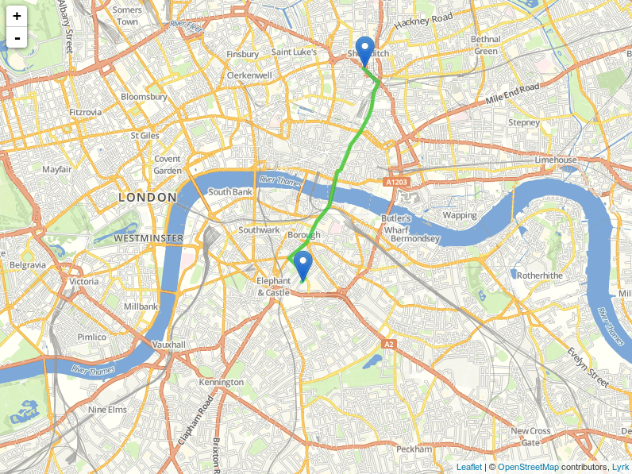
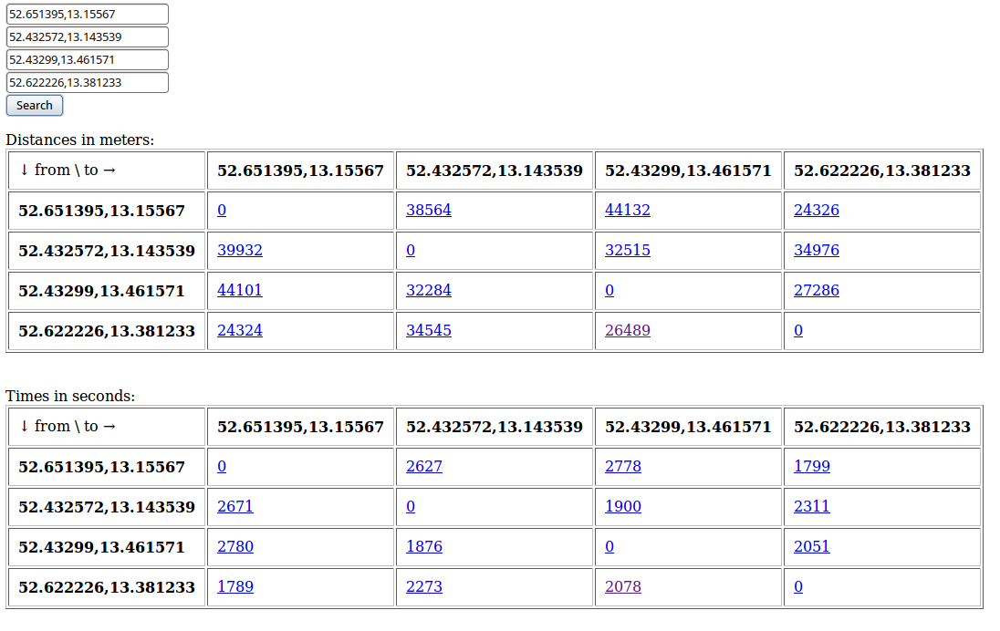
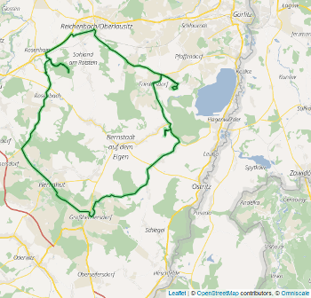

# JavaScript client for the Directions API

[](https://travis-ci.org/graphhopper/directions-api-js-client)

This project offers JavaScript clients and examples for the [GraphHopper Directions API](https://graphhopper.com).

**Try the live examples [here](https://graphhopper.com/api/1/examples/).**

Also see how we integrated the Routing and the Geocoding API to build a fully featured maps application called [GraphHopper Maps](https://graphhopper.com/maps/)

## Getting Started

### NPM

Install the lib with npm:

```npm install graphhopper-js-api-client --save```

You can either require the whole client enabling you to use every GraphHopper API, but you can also only require the pieces you need.

```javascript
require('graphhopper-js-api-client');
 
window.onload = function() {
  let defaultKey = "[Sign-up for free and get your own key: https://www.graphhopper.com/products/]";
  let ghRouting = new GraphHopper.Routing({key: defaultKey}, {profile:"car", elevation: false});

  ghRouting.doRequest({points:[[8.534317, 47.400905], [8.538265, 47.394108]]})
    .then(function(json){
       // Add your own result handling here
       console.log(json);
    })
    .catch(function(err){
       console.error(err.message);
    });
};
```

## Running Tests

In order to run the tests, you have to register for a key on [GraphHopper](https://www.graphhopper.com/).
Either set your key as environment variable using `export GHKEY=YOUR_KEY` or set your key in `spec/helpers/config.js`.
You can run all tests via `npm test`. 
If you only want to run a single spec file, you can use the `--spec` option, e.g., `npm test --spec spec/GraphHopperRoutingSpec.js`.

## Dependencies

The API depends on superagent and bluebird which are packaged into the graphhopper-client.js.

The demo uses a couple of dependencies, but they are not required for requests to the API.

## Integrate the APIs in your application

You can either use our [bundled version](./dist/graphhopper-client.js), including all APIs or you can use only the 
pieces you need.

### GraphHopper Routing API



You need [the routing client](./src/GraphHopperRouting.js).

There is also a different client developed from the community [here](https://www.npmjs.com/package/lrm-graphhopper).

### GraphHopper Route Optimization API


You need [the optimization client](./src/GraphHopperOptimization.js).

### GraphHopper Isochrone API


You need [the isochrone client](./src/GraphHopperIsochrone.js)

### GraphHopper Matrix API



You need [the matrix client](./src/GraphHopperMatrix.js).

### GraphHopper Geocoding API


You need [the geocoding client](./src/GraphHopperGeocoding.js).

### GraphHopper Map Matching API



You need [the map matching client](./src/GraphHopperMapMatching.js) and the 
[togeojson.js](./js/togeojson.js)

## Releasing a new Version to NPM

Releasing a new version to NPM is easy.

Set the version you like to publish in the `package.json`. It's important to understand, that every version can only be published once and cannot be overwritten.

Tag the commit you like to publish for example like this:
```
git log # get the commit hash of the commit you want to tag
git tag <tag> <commit-hash>
git push origin --tags
```

Travis will then build and publish the commit to NPM.

## License

Code stands under Apache License 2.0
